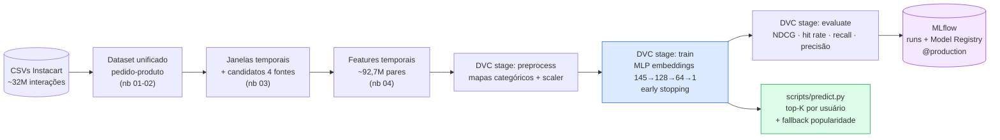

# MLP Market Recommender — Recomendação do Próximo Carrinho


Sistema **end-to-end de recomendação de produtos** para e-commerce alimentar:
dado o histórico de pedidos de um usuário, o modelo prevê o que ele compra no
**próximo carrinho**. Um gerador de candidatos seleciona até 200 produtos por
usuário (recompra, similaridade, categoria, popularidade) e uma **MLP em
PyTorch** com embeddings reordena essa lista — **NDCG@10 de 0,4999 contra
0,4678** do melhor baseline heurístico.

Construído sobre o dataset [Instacart Market Basket](https://www.kaggle.com/competitions/instacart-market-basket-analysis)
(~3,4M pedidos, ~206 mil usuários), com pipeline reprodutível via **DVC**,
experimentos rastreados no **MLflow** (Model Registry com modelo em
`@production`) e dados versionados no **Google Cloud Storage**.

> Projeto do **Tech Challenge Fase 02 — POSTECH (Grupo 02)**.

---

## Demo

### Apresentação em vídeo (Método STAR — 5 min)

[](https://www.youtube.com/watch?v=8GnJN1IQ_VA)

### MLflow na nuvem (Cloud Run)

**https://mlflow-66vp6r5t4q-uc.a.run.app**

Servidor de tracking público do projeto: a aba **Experiments** tem as runs do
pipeline (parâmetros, métricas por split/k e artefatos) e a aba **Models** tem
o `mlp-temporal-recommender` com os aliases `@staging` e `@production`.

> O serviço escala a zero quando ocioso — o primeiro acesso pode levar
> ~15–30 s (cold start). Backend SQLite em GCS via volume FUSE e artefatos no
> bucket do projeto.

---

## Resultados

Ranking avaliado dentro de cada janela de usuário, no split de **validação**
(seleção de modelo por NDCG@10). O teste (holdout final) confirma os números:
NDCG@10 de **0,4948**.

| Modelo | NDCG@10 | Hit rate@10 | Recall local@10 | Precisão@10 | Status |
|---|---|---|---|---|---|
| Afinidade de categoria | 0,2174 | 0,6481 | 0,2120 | 0,1264 | Fallback de descoberta |
| Heurístico temporal | 0,4557 | 0,8563 | 0,4413 | 0,2736 | Descartado |
| Recompra do usuário | 0,4677 | 0,8645 | 0,4564 | 0,2809 | Baseline forte |
| Ordem do gerador de candidatos | 0,4678 | 0,8646 | 0,4567 | 0,2810 | **Melhor baseline** |
| **MLP temporal (PyTorch)** | **0,4999** | **0,9086** | **0,4876** | **0,3119** | ✅ **Produção** |

Em 10 sugestões, ~91% dos pedidos têm ao menos um acerto. Métricas completas
(validação e teste, k = 5/10/20): [reports/metrics.json](reports/metrics.json)
e [Model Card](docs/model_card.md).

---

## Arquitetura do Pipeline



Os notebooks `01`–`04` constroem o dataset temporal (determinístico,
versionado por DVC); o pipeline `dvc repro` cobre `preprocess → train →
evaluate` a partir dele. A divisão é **temporal por usuário**: cada usuário
gera 2 janelas de treino + 1 de validação no histórico `prior`, e o último
pedido (`eval_set=train` do Instacart) fica como holdout de teste — sem
vazamento de futuro para o passado.

---

## Pré-requisitos

- **[uv](https://docs.astral.sh/uv/getting-started/installation/)** — gerenciador
  de pacotes e ambientes Python (resolve as versões exatas do `uv.lock`).
  É o único pré-requisito para reproduzir o projeto — o download dos dados
  (`dvc pull`) não exige conta GCP.

```bash
# macOS/Linux
curl -sSf https://astral.sh/uv/install.sh | sh
# Windows
powershell -c "irm https://astral.sh/uv/install.ps1 | iex"
```

---

## Dataset

Os dados brutos e o dataset temporal de modelagem **não estão no git** — são
versionados pelo **DVC** com remote no Google Cloud Storage. O remote é
**público para leitura** (o dataset Instacart é aberto), então baixar os dados
não exige conta GCP nem autenticação:

```bash
uv run dvc pull    # baixa dados brutos + dataset temporal (~1,3 GB), sem login
```

> Escrever no remote (`dvc push`) continua restrito ao time, via
> `gcloud auth application-default login`.

Alternativa sem DVC: baixe os CSVs originais no
[Kaggle](https://www.kaggle.com/competitions/instacart-market-basket-analysis/data),
extraia-os em `data/raw/` e execute os notebooks `01`–`04` para regenerar o
dataset temporal (a geração é determinística).

---

## Quickstart

```bash
# 1. Clonar e instalar (versões exatas do lock)
git clone https://github.com/helioneto3108/mlp-market-recommender-system.git
cd mlp-market-recommender-system
uv sync
cp .env.example .env          # defaults funcionam para uso local

# 2. Baixar os dados (ver seção Dataset)
uv run dvc pull

# 3. Reproduzir o pipeline completo: preprocess → train → evaluate
uv run dvc repro
cat reports/metrics.json

# 4. Qualidade: testes e lint
uv run pytest                          # 38 testes
uv run ruff check src tests scripts   # lint limpo

# 5. Gerar recomendações para um usuário
uv run python -m scripts.predict --user-id 1000 --top-k 5
```

> **Nota:** o treino roda em CPU (~horas para 30 épocas com batch 8192 em
> ~92,7M pares). Para um ciclo rápido de validação, reduza `max_epochs` em
> `params.yaml` — o DVC detecta a mudança e reexecuta só o necessário.

---

## MLflow — experimentos e Model Registry

Suba o servidor local e registre/promova o modelo:

```bash
# Terminal 1 — servidor de tracking
uv run mlflow server --host 127.0.0.1 --port 5000 --backend-store-uri sqlite:///mlflow.db

# Terminal 2 — registra o modelo e promove @staging → @production
uv run python -m scripts.register_model
```

Em `http://localhost:5000`: aba **Experiments** com as runs (parâmetros,
métricas por split/k, artefatos) e aba **Models** com o
`mlp-temporal-recommender` e seus aliases. O fluxo completo do Registry está
explicado no notebook [07-mlflow-registry.ipynb](notebooks/07-mlflow-registry.ipynb).

A URI de tracking vem do `.env` (`MLFLOW_TRACKING_URI`) via Pydantic Settings —
trocar entre servidor local, docker-compose e Cloud Run é só editar o `.env`.

---

## Docker

Imagem **multi-stage** (builder instala as deps com `uv sync --frozen`;
runtime leva só o `.venv` e o código, com usuário não-root) e compose com dois
serviços — o MLflow server e o pipeline de treino:

```bash
# Build da imagem (torch resolve do índice CPU no Linux — imagem enxuta)
docker build -t mlp-recommender .

# Sobe o MLflow server com persistência (volume nomeado)
docker compose up mlflow -d          # UI em http://localhost:5000

# Roda o pipeline completo no container, logando no MLflow do compose
docker compose run train
```

Dentro da rede do compose, o serviço de treino alcança o MLflow pelo hostname
interno `mlflow` (`MLFLOW_TRACKING_URI=http://mlflow:5000`) — a mesma imagem e
o mesmo código logam no Cloud Run em produção trocando apenas o `.env`.

A imagem publicada no Artifact Registry
(`us-central1-docker.pkg.dev/mlp-market-recommender-gp16/mlp-recommender`) é a
que roda o MLflow no Cloud Run.

---

## Estrutura do Projeto

```
mlp-market-recommender-system/
├── src/
│   ├── config/          # Pydantic Settings (.env → objetos tipados)
│   ├── data/            # Dataset PyTorch dos pares (janela, candidato)
│   ├── features/        # Preprocessing (mapas categóricos, scaler) + popularidade
│   ├── models/          # MLPRecommender (embeddings + densas) + Factory
│   ├── training/        # Loop de treino, early stopping, inferência
│   └── evaluation/      # Métricas de ranking (NDCG, hit rate, recall, precisão)
├── scripts/
│   ├── stages/          # Entrypoints do DVC: preprocess · train · evaluate
│   ├── predict.py       # CLI de inferência: top-K por usuário
│   └── register_model.py# Registro e promoção no MLflow Registry
├── api/                 # API FastAPI de recomendação (demo)
├── services/            # Serviços de domínio consumidos pela API
├── frontend/            # Dashboard React (demo com dados mockados)
├── notebooks/           # 01 dataset · 02 EDA · 03 candidatos · 04 features
│                        # 05 baselines · 06 experimentos · 07 registry
├── data/                # Versionado por DVC (raw + features), fora do git
├── models/              # Checkpoint do MLP (saída do pipeline)
├── reports/             # metrics.json · training_history.csv
├── tests/               # 38 testes (pytest)
├── docs/                # Model Card, revisão de integração, handoffs
├── dvc.yaml             # Pipeline: preprocess → train → evaluate
├── params.yaml          # Hiperparâmetros do pipeline (fonte única)
├── pyproject.toml       # Dependências prod/dev (uv) + ruff + pytest
└── uv.lock              # Lock file — reprodutibilidade exata
```

---

## Tecnologias

| Categoria | Stack |
|---|---|
| Modelo | PyTorch (MLP ranker com embeddings), scikit-learn (padronização) |
| Dados | pandas + PyArrow (parquet particionado) |
| Pipeline | DVC (3 stages, remote no Google Cloud Storage) |
| Rastreamento | MLflow (runs, métricas, artefatos, Model Registry) |
| Config | Pydantic Settings + `.env` (nada hardcoded) |
| Qualidade | ruff (lint + format) · pytest (38 testes) · type hints |
| Ambiente | uv + `uv.lock` (Python 3.12) |

---

## Documentação

| Documento | Descrição |
|---|---|
| [Model Card](docs/model_card.md) | Arquitetura, métricas, limitações, vieses e uso responsável |
| [Revisão de integração](docs/revisao_integracao_notebooks.md) | Auditoria dos notebooks, bug de reprodutibilidade cross-platform e correções |
| [Notebooks 01–07](notebooks/) | História completa do projeto com decisões explicadas em markdown |

---

## Roadmap

**Etapa 1 — Clean Code e Estrutura**
- [x] Código modular em `src/` com SOLID, type hints e docstrings Google style
- [x] Design pattern: Factory com registro de modelos (princípio aberto/fechado)
- [x] Ruff sem erros + 38 testes

**Etapa 2 — Ambiente e Dependências**
- [x] uv + `uv.lock` commitado, deps prod/dev separadas
- [x] Configuração externalizada (`.env` + Pydantic Settings)

**Etapa 3 — Containerização e Versionamento**
- [x] DVC: dataset versionado no GCS + pipeline de 3 stages (`dvc repro`)
- [x] Dockerfile multi-stage + docker-compose (MLflow server + treino)
- [x] MLflow no Cloud Run (URL pública) — bônus de deploy em nuvem

**Etapa 4 — Rede Neural, Registry e Entrega**
- [x] MLP com embeddings + early stopping, superando 4 baselines em 4+ métricas
- [x] MLflow Registry: modelo promovido a `@production`
- [x] Model Card
- [x] Vídeo STAR (5 min)

---

## Licença

[MIT](LICENSE) — POSTECH Tech Challenge Fase 02, Grupo 02.
