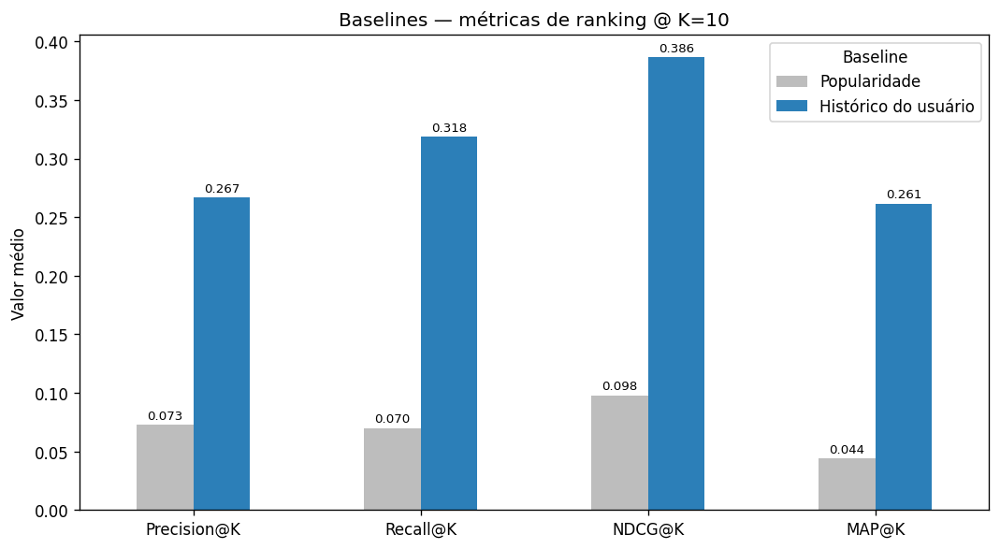

# Relatório de Baselines e Métricas de Ranking
## Sistema de Recomendação de Produtos — Instacart

> **Para quem é este documento:** o time técnico (cientista de dados / ML
> engineer) que precisa entender **como** medimos a qualidade das recomendações e
> **quais baselines** a rede neural terá de superar; e o time de negócio que quer
> a intuição de **por que** essa "régua" existe — sem ler código.
>
> Gerado a partir de [`notebooks/04_baselines.ipynb`](../notebooks/04_baselines.ipynb).

---

## 🎯 Resumo executivo

- Antes de investir em uma rede neural cara, definimos uma **régua**: dois
  baselines simples + quatro métricas de ranking. Só assim sabemos se o modelo
  neural **vale a pena**.
- Avaliamos sobre o **próximo pedido real** de **131.209 clientes** (cesta média
  de ~10,6 produtos).
- O baseline de **histórico do usuário** (recomendar o que ele mais compra) é
  **muito superior** ao de popularidade — porque no Instacart o próximo pedido é
  majoritariamente **recompra**. Esse é o número que a rede neural precisa bater.

| Métrica @ K=10 | Popularidade | Histórico do usuário |
|---|---|---|
| Precision@10 | 0,073 | **0,267** |
| Recall@10 | 0,070 | **0,318** |
| NDCG@10 | 0,098 | **0,386** |
| MAP@10 | 0,044 | **0,261** |

---

## 1. Por que precisamos de uma "régua"?

> 👔 **Visão de negócio:** não dá para dizer que um sistema de recomendação é
> "bom" no vácuo — bom *comparado a quê?* Primeiro montamos alternativas baratas
> e óbvias; o modelo sofisticado só se justifica se as superar de forma clara.

> 🔬 **Visão técnica:** baselines protegem contra *overengineering* e dão um piso
> de referência. O enunciado exige comparar a rede com baselines usando ≥ 4
> métricas — então construímos a régua **antes** do modelo.

**Protocolo.** Para cada usuário do conjunto de validação (o último pedido,
separado sem *data leakage* no notebook 02), cada baseline gera um **ranking de
produtos**. Comparamos o *top-K* recomendado com os produtos que ele realmente
comprou. Itens *cold-start* (produtos nunca vistos no histórico) são descartados
da verdade-base, pois nenhum baseline consegue pontuá-los.

---

## 2. Os dois baselines

**A — Popularidade global.** Recomenda os produtos mais vendidos para *todos* os
clientes, igual, sem personalização. É o **piso**: qualquer modelo "inteligente"
tem de superá-lo.

**B — Histórico do usuário.** Para cada cliente, recomenda *os próprios produtos
que ele mais compra*, ordenados por frequência. Usa popularidade como *fallback*
para quem tem pouco histórico.

> 👔 **Visão de negócio:** o baseline B é o "bom senso" — *as pessoas tendem a
> recomprar o que já compram*. É surpreendentemente difícil de superar.

> 🔬 **Visão técnica:** B explora o forte sinal de *reorder* do Instacart. É o
> verdadeiro alvo competitivo; bater apenas a popularidade seria fácil e pouco
> significativo.

---

## 3. As quatro métricas

Todas avaliadas no *top-K* (mostramos K = 5, 10 e 20):

| Métrica | Pergunta que responde | Sensível à ordem? |
|---|---|---|
| **Precision@K** | Dos K recomendados, quantos acertei? | Não |
| **Recall@K** | Do que ele comprou, quanto cobri? | Não |
| **NDCG@K** | Acertei nas **primeiras** posições? | **Sim** (desconto log) |
| **MAP@K** | Quão boas são, em média, as posições dos acertos? | **Sim** |

> 🔬 **Por que quatro?** Precision e Recall trocam entre si (aumentar K sobe o
> recall e derruba a precisão); NDCG e MAP capturam a **qualidade da ordenação**,
> que as duas primeiras ignoram. Juntas, dão um retrato completo.

---

## 4. Resultados

Tabela completa (gerada em `data/processed/baseline_metrics.parquet`):

| Baseline | K | Precision | Recall | NDCG | MAP |
|---|---|---|---|---|---|
| Popularidade | 5 | 0,096 | 0,047 | 0,110 | 0,062 |
| Histórico do usuário | 5 | **0,344** | **0,223** | **0,405** | **0,307** |
| Popularidade | 10 | 0,073 | 0,070 | 0,098 | 0,044 |
| Histórico do usuário | 10 | **0,267** | **0,318** | **0,386** | **0,261** |
| Popularidade | 20 | 0,051 | 0,095 | 0,097 | 0,039 |
| Histórico do usuário | 20 | **0,192** | **0,423** | **0,401** | **0,254** |

**Leitura dos números:**
- O histórico do usuário é **3–5× melhor** que a popularidade em todas as
  métricas — confirma que o próximo pedido é dominado por recompras.
- Conforme **K cresce**, a **precisão cai** e o **recall sobe** (mais slots →
  mais chance de cobrir a cesta, mas também mais "tiros perdidos") — o
  *trade-off* clássico.
- O **NDCG** do histórico se mantém alto e estável (~0,39–0,41): os acertos
  aparecem **no topo** da lista, que é o que importa numa recomendação.

---

## 5. Implicações para a modelagem

- **Régua pronta e reutilizável:** a função `evaluate` aceita *qualquer*
  recomendador (princípio aberto/fechado — SOLID). O NCF será plugado nela **sem
  alterar** o código de avaliação.
- **Meta clara:** o NCF precisa superar o **histórico do usuário** (NDCG@10 ≈
  0,386), não apenas a popularidade. Caso contrário, não estará aprendendo nada
  além de "repita o que já comprou".
- **Trunfo do neural:** diferentemente do histórico, o NCF pode recomendar
  produtos **novos** (que o usuário ainda não comprou) via similaridade de
  *embeddings* — justamente onde o baseline B tem recall limitado.

**Próximo passo (`notebook 05`):** treinar a rede **NCF** (embeddings de usuário
e produto + MLP) com *negative sampling* por época e *early stopping*, e avaliá-la
nesta mesma régua para a comparação final.

---

Números e gráfico derivados de [`notebooks/04_baselines.ipynb`](../notebooks/04_baselines.ipynb)
e do artefato `data/processed/baseline_metrics.parquet`.
