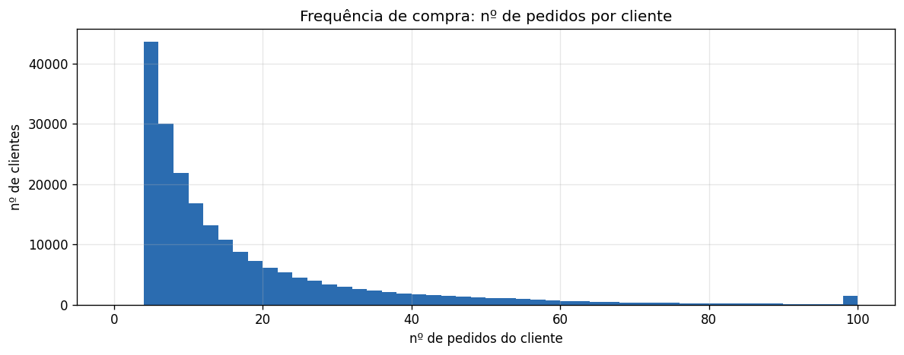
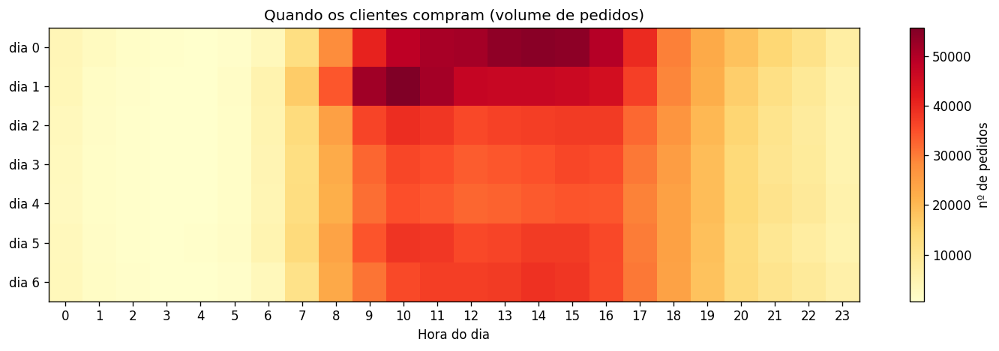
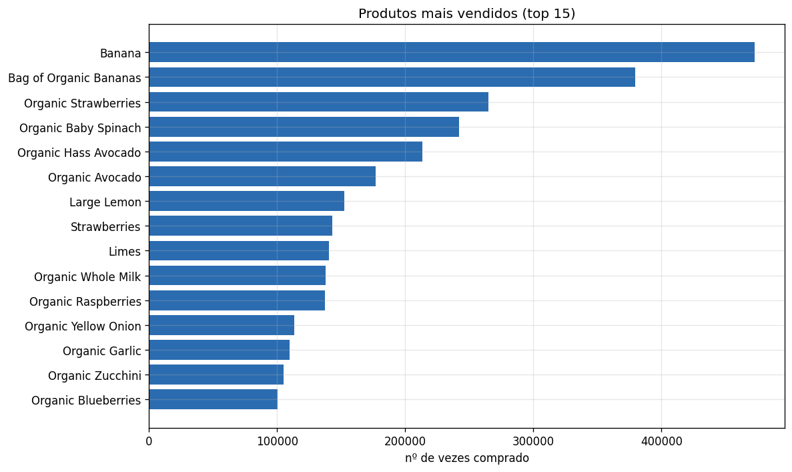
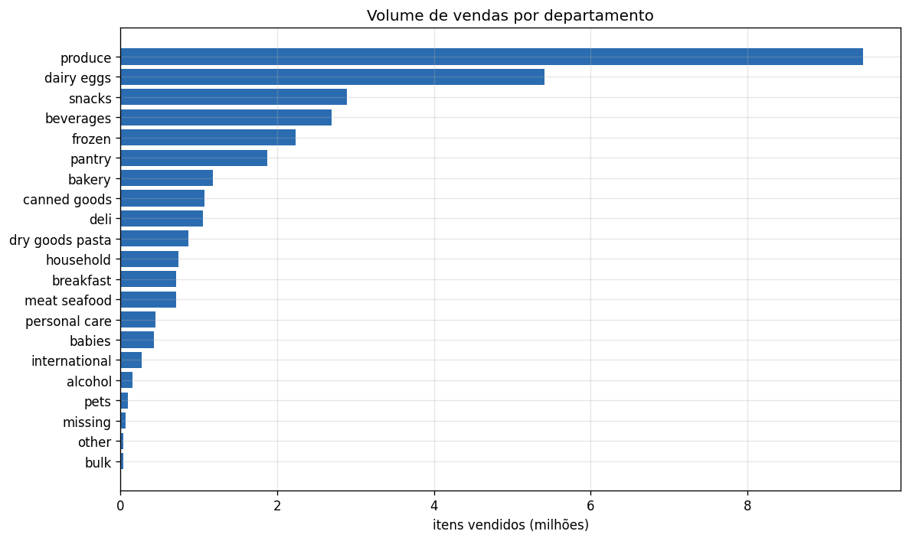
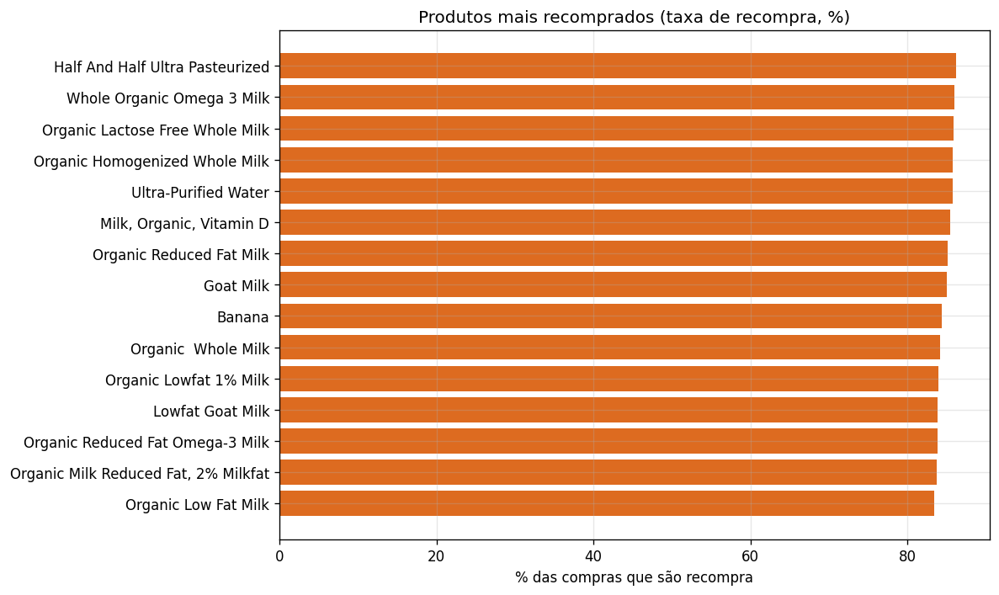
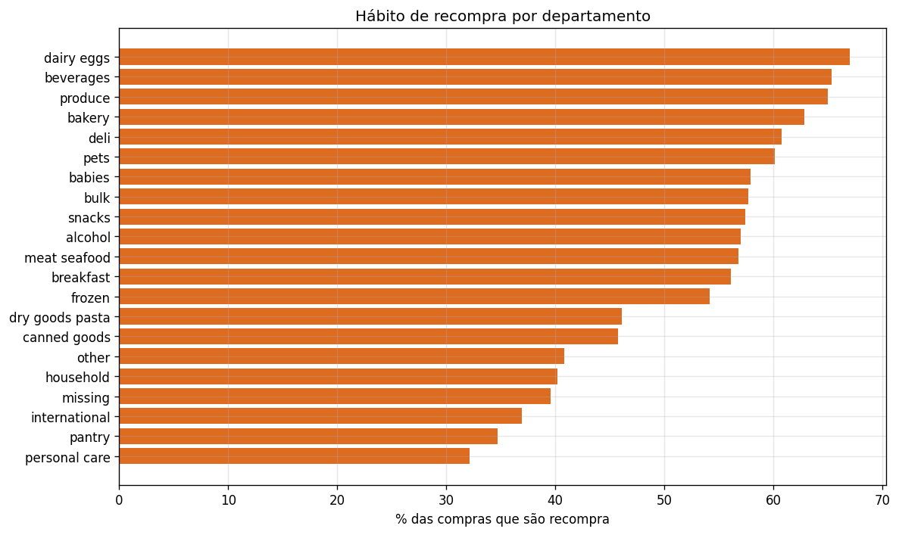

# Relatório de Análise Exploratória (EDA)
## Sistema de Recomendação de Produtos — Instacart

> **Para quem é este documento:** qualquer pessoa do time — de negócio, produto
> ou dados — que queira entender **o que os dados nos contam** e **por que um
> sistema de recomendação faz sentido aqui**, sem precisar ler código.
>
> Os números vêm da análise feita no notebook [`notebooks/01_eda.ipynb`](../notebooks/01_eda.ipynb).

---

## 🎯 Resumo executivo

- A base tem **206 mil clientes**, **3,4 milhões de pedidos** e **~50 mil
  produtos** — mais de **32 milhões de itens comprados** no histórico.
- **59% de tudo o que é comprado é recompra**: o cliente já tinha levado aquele
  produto antes. Ou seja, **compra de supermercado é, em grande parte, hábito.**
- Esse hábito é a **maior oportunidade de negócio**: se conseguimos prever o que
  cada cliente vai recomprar, podemos **montar o carrinho para ele**, lembrar de
  itens esquecidos e reduzir o atrito da compra.
- **Hortifrúti e laticínios** são, ao mesmo tempo, os **mais vendidos** e os de
  **maior recompra** — o coração do relacionamento com o cliente.
- Conclusão: há **dados de sobra e um padrão de comportamento claro** para
  treinar um sistema de recomendação personalizado.

---

## 1. O tamanho do negócio nos dados

Antes de qualquer modelo, vale entender a escala do que temos em mãos:

| Indicador | Valor |
|---|---|
| Clientes | **206.209** |
| Pedidos | **3.421.083** |
| Produtos no catálogo | **49.688** |
| Itens comprados (histórico) | **32.434.489** |
| Departamentos / corredores | 21 / 134 |

É um volume robusto e representativo — base sólida para tirar conclusões
confiáveis e treinar um modelo de recomendação.

---

## 2. Com que frequência os clientes compram?

**O que o gráfico mostra:** a maioria dos clientes fez **poucos pedidos** (entre
4 e 10), e a quantidade vai caindo conforme aumenta o número de pedidos. Existe,
porém, uma **base fiel** que comprou dezenas de vezes (a "ponta" à direita, com
um grupo que chegou ao máximo de 100 pedidos registrados).

**Leitura de negócio:** há um grande público de clientes leves (oportunidade de
**aumentar a frequência**) e um núcleo de clientes fiéis (oportunidade de
**fidelizar e aumentar o ticket**). Recomendação ajuda nos dois casos.

---

## 3. Quando os clientes compram?

**Como ler:** cada quadrado é um cruzamento de **dia da semana** (linhas) com
**hora do dia** (colunas). Quanto mais escuro/vermelho, mais pedidos.

**O que salta aos olhos:**
- **Dois dias concentram o maior volume** (as duas primeiras linhas — muito
  provavelmente o fim de semana).
- As compras se concentram no **horário comercial, das ~8h às ~18h**, com picos
  no **meio da manhã** e **início da tarde**. De madrugada quase não há pedidos.

**Leitura de negócio:** é o melhor momento para **campanhas, push de
recomendações e garantir disponibilidade de estoque/operação** — quando o
cliente está de fato comprando.

---

## 4. O que mais vende?

**Destaque absoluto: hortifrúti.** A **Banana** é o produto nº 1 (comprada mais
de 470 mil vezes), seguida da versão orgânica e de morangos, espinafre e
abacate. Praticamente todo o top 15 é fruta, verdura e legume — com leite como
única exceção.

Olhando por **departamento**, o padrão se confirma:

**`produce` (hortifrúti)** vende quase o dobro do segundo colocado,
**`dairy eggs` (laticínios e ovos)**. Juntos, são o motor de vendas da operação.

---

## 5. O segredo do negócio: recompra (hábito)

Esta é a descoberta mais importante para um sistema de recomendação.

> ### 🔁 59% de todas as compras são recompra
> Em média, **6 de cada 10 itens** que entram num carrinho já tinham sido
> comprados antes pelo mesmo cliente.

Quando olhamos **quais produtos** têm maior taxa de recompra, o perfil é claro —
são os **itens de consumo recorrente**:

Diversos tipos de **leite** e a **banana** lideram, com **~84% a 86% de
recompra**. São produtos comprados quase "no automático".

E por **departamento**, o hábito também tem cara:

- **Mais habituais (alta recompra):** laticínios/ovos, bebidas, hortifrúti e
  padaria (~63% a 67%). São compras de rotina.
- **Menos habituais (mais "descoberta"):** cuidado pessoal, mercearia seca
  (*pantry*) e itens de casa (~32% a 40%). São compras mais esporádicas ou
  pontuais.

**Leitura de negócio:**
- Nos **departamentos de hábito**, a recomendação tem enorme valor: prever a
  recompra e **lembrar o cliente** antes que ele esqueça (ou compre no
  concorrente).
- Nos **departamentos de descoberta**, a recomendação muda de papel: **sugerir
  novidades** e produtos complementares.

---

## 6. O que isso significa para o sistema de recomendação

Juntando tudo, a estratégia do produto fica clara:

| O que os dados mostram | Como o sistema de recomendação aproveita |
|---|---|
| 59% das compras são recompra | Prever e **antecipar a recompra** (carrinho sugerido) |
| Hortifrúti/laticínios dominam | Acertar bem o "básico" e personalizar o resto |
| Cada cliente compra ~64 produtos distintos | Personalização real, cliente a cliente |
| Base grande e comportamento claro | Dados suficientes para um modelo confiável |

> **Nota técnica (opcional):** como não existem "notas/estrelas" dos clientes, o
> sinal que o modelo aprende é a própria **compra/recompra** (a chamada
> *feedback implícito*). Vamos comparar uma **rede neural** (que personaliza por
> cliente) contra uma **régua de referência simples** ("recomende os mais
> populares") para provar que a personalização entrega valor de verdade.

---

## 7. Próximos passos

1. **Organizar o código** da leitura e limpeza dos dados em módulos reutilizáveis.
2. **Construir as features** (sinais) sugeridas pela análise: frequência, horário,
   recência, taxa de recompra por cliente e por produto.
3. **Treinar e avaliar** o modelo de recomendação, comparando com a régua de
   popularidade.
4. **Acompanhar os resultados** com métricas de qualidade de recomendação.

---

Gráficos e números derivados da análise em [`notebooks/01_eda.ipynb`](../notebooks/01_eda.ipynb),
a partir dos dados em `data/raw/`.
