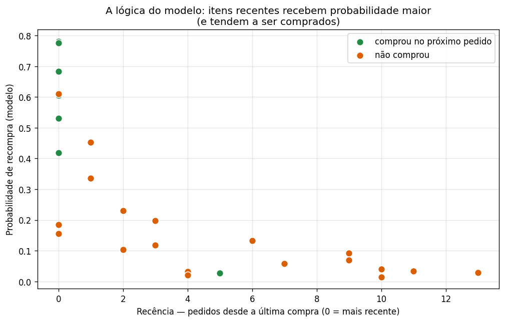
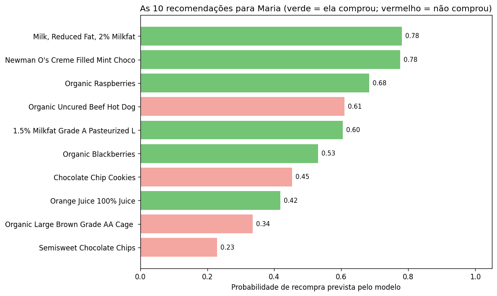

# Como o modelo funciona, na prática — o caso da Maria
## Sistema de Recomendação de Produtos — Instacart

> **Documento didático.** Seguimos **um cliente real** do conjunto de teste
> (anonimizado como "Maria") **passo a passo pelo modelo de verdade** — com os
> produtos, as features, as probabilidades e o ranking **reais** que o modelo
> treinado produziu. O objetivo é mostrar, sem fórmulas, **o que** o modelo faz e
> **como** ele faz.
>
> Pré-requisito leve: o documento [modelo, métricas e resultados](modelo_metricas_resultados.md)
> explica os conceitos (embedding, features, métricas). Aqui, **aplicamos tudo**.

---

## A pergunta

> *"Quais produtos a Maria vai querer no próximo pedido?"*

A Maria já fez vários pedidos no histórico. O modelo vai usar esse comportamento
para montar uma lista de recomendações — e depois conferimos com o que ela
**realmente** comprou.

O modelo faz isso em **5 passos**:

```
1. Reunir candidatos  →  2. Descrever com features  →  3. Pontuar  →  4. Ranquear  →  5. Conferir
```

---

## Passo 1 — Reunir os candidatos

O modelo lista os produtos que a Maria **já comprou** alguma vez no histórico.
São os **candidatos** — no caso dela, **26 produtos**.

> 🔎 **Por que só o que ela já comprou?** Porque a tarefa é prever **recompra**.
> Produtos totalmente novos (que ela nunca comprou) não entram nesta lista — é uma
> limitação consciente do modelo. *(Curiosidade: o próximo pedido real da Maria foi
> 100% de itens que ela já conhecia — nenhum produto novo.)*

---

## Passo 2 — Descrever cada candidato com features

Para **cada um** dos 26 candidatos, o modelo calcula as features de comportamento
(as mesmas explicadas no outro documento): **frequência**, **recência**,
**intensidade**, etc. Alguns exemplos reais da Maria:

| Produto | comprou (`n_orders`) | recência | frequência | intensidade | → prob |
|---|---|---|---|---|---|
| Milk, Reduced Fat 2% | 15 | **0** (último pedido) | 1,00 (todo pedido) | 1,00 | **0,78** |
| Organic Raspberries | 10 | 0 | 0,67 | 0,91 | 0,68 |
| Chocolate Chip Cookies | 9 | 1 | 0,60 | 0,60 | 0,45 |
| Organic Strawberries | 3 | **6** (faz tempo) | 0,20 | 0,27 | 0,13 |
| Baby Spinach | 1 | **10** (faz muito tempo) | 0,07 | 0,09 | 0,04 |

> 📋 Repare no padrão: produtos comprados **muito** e **recentemente** (leite) têm
> valores altos; produtos comprados **uma vez, há muito tempo** (spinach) têm
> valores baixos. A última coluna (probabilidade) já antecipa o resultado.

---

## Passo 3 — O modelo pontua cada candidato

Cada candidato (com seus embeddings de produto/seção/departamento **+** suas
features) passa pela rede neural, que devolve uma **probabilidade de recompra**
(0 a 100%):


A lógica aprendida fica nítida quando olhamos **probabilidade × recência** para os
26 candidatos da Maria:



> 🧠 **O que o gráfico mostra:** o modelo dá **probabilidade alta** aos itens
> comprados **recentemente** (esquerda) e **baixa** aos "esquecidos" (direita). E
> os itens que ela **realmente comprou** (verde) estão quase todos no canto
> superior esquerdo — exatamente onde o modelo apostou. É a feature de recência
> (e intensidade) em ação.

---

## Passo 4 — Ordenar e recomendar o top-10

O modelo ordena os 26 candidatos pela probabilidade e recomenda os **10
primeiros**:



| # | Produto recomendado | Probabilidade | Ela comprou? |
|---|---|---|---|
| 1 | Milk, Reduced Fat 2% | 0,78 | ✅ |
| 2 | Newman O's Creme Filled Mint Cookies | 0,78 | ✅ |
| 3 | Organic Raspberries | 0,68 | ✅ |
| 4 | Organic Uncured Beef Hot Dog | 0,61 | ❌ |
| 5 | 1.5% Cottage Cheese | 0,60 | ✅ |
| 6 | Organic Blackberries | 0,53 | ✅ |
| 7 | Chocolate Chip Cookies | 0,45 | ❌ |
| 8 | Orange Juice 100% | 0,42 | ✅ |
| 9 | Organic Large Brown Eggs | 0,34 | ❌ |
| 10 | Semisweet Chocolate Chips | 0,23 | ❌ |

**6 das 10 recomendações ela realmente comprou** (✅). As 4 erradas (❌) eram
apostas razoáveis — produtos que ela compra com alguma frequência, mas que **não**
entraram neste pedido específico.

---

## Passo 5 — Conferir o acerto (as métricas)

O **próximo pedido real** da Maria teve **7 itens** — e o modelo acertou **6**
deles dentro do top-10:

| Métrica | Valor | Leitura |
|---|---|---|
| **Precision@10** | **0,60** | de 10 recomendações, 6 ela comprou |
| **Recall@10** | **0,86** | das 7 compras dela, cobrimos 6 |
| **NDCG@10** | **0,88** | e os acertos vieram **no topo** da lista |

> 🎯 Esses números (bem acima da média geral do modelo) mostram um caso de cliente
> "fácil": comportamento regular e recompra forte. Para o cliente médio, lembre
> que a média é Precision ~0,30 e Recall ~0,35.

### E o que o modelo errou? (transparência)

- **Falsos positivos** (recomendou, ela não comprou): _Beef Hot Dog_ (#4) e
  _Chocolate Chip Cookies_ (#7) — itens que ela compra às vezes, mas não desta vez.
- **O acerto que escapou:** ela comprou _Unsweetened Chocolate Baking Bar_, que o
  modelo classificou bem **embaixo** (probabilidade 0,03) — porque ela só o comprou
  **uma vez, há 5 pedidos**. Sem sinal de frequência/recência, o modelo não tinha
  como prever. É uma limitação honesta.

---

## O que esse exemplo ensina

1. **O modelo "descreve para decidir".** Ele não tem mágica: transforma o histórico
   de cada par cliente-produto em **números de comportamento** (frequência,
   recência, intensidade), pontua e ordena.
2. **Recência e intensidade mandam.** Os itens do topo são os que ela compra
   **muito** e **há pouco tempo** — coerente com a análise de importância das
   features.
3. **As forças e os limites ficam visíveis:** acerta muito bem o que é **rotina**
   de compra; erra em itens **raros/antigos** e não prevê produtos **novos** (fora
   do histórico).

> 💡 Em produção, essa lista de top-10 da Maria viraria as recomendações que ela
> veria na vitrine, no carrinho ("compre de novo") ou num e-mail de lembrete.

---

<sub>Caso real (cliente anonimizado) do conjunto de avaliação, gerado com o modelo
`models/feature_mlp.pt` sobre `data/processed/candidate_features.parquet`. Nomes de
produtos de `data/raw/products.csv`. Figuras em `docs/img/example/`.</sub>
