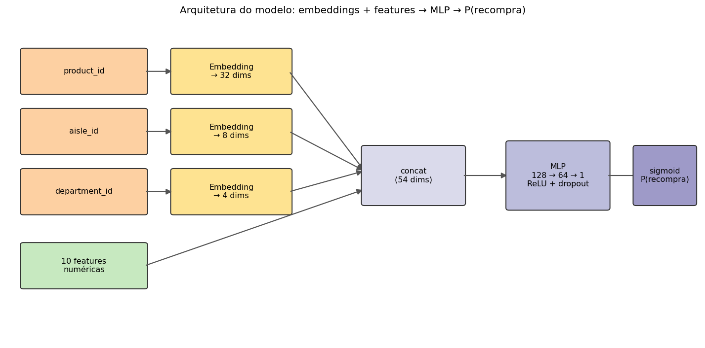
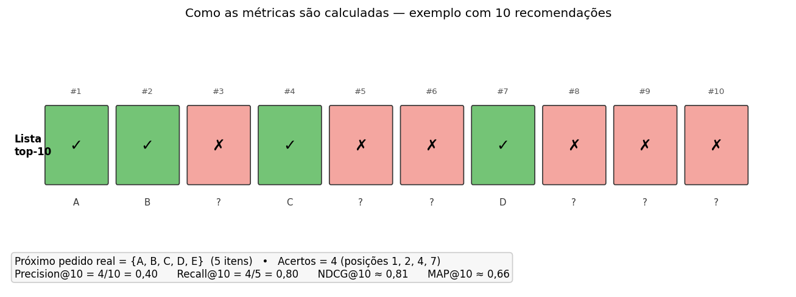
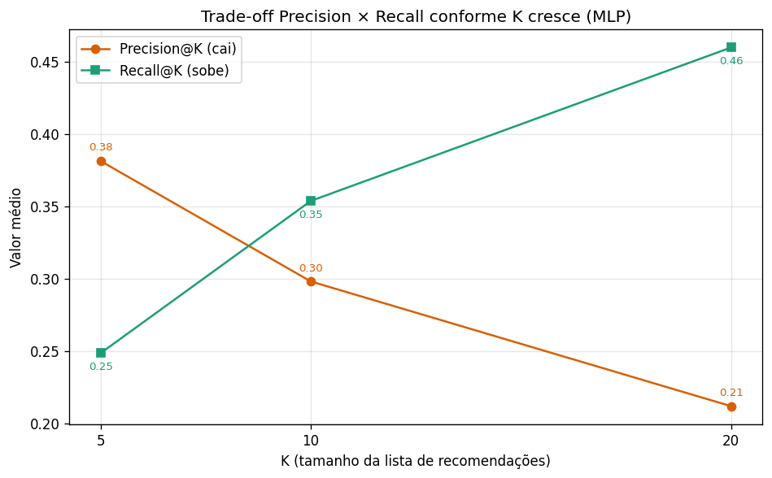
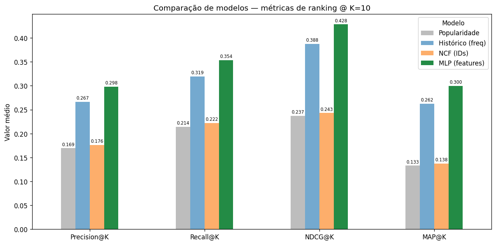
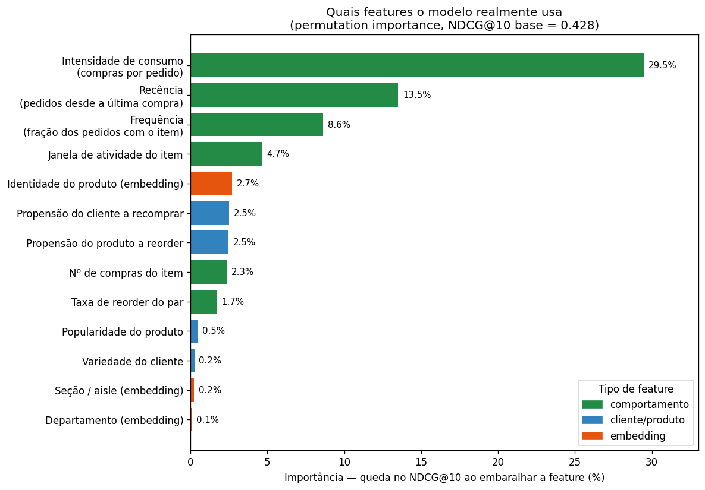
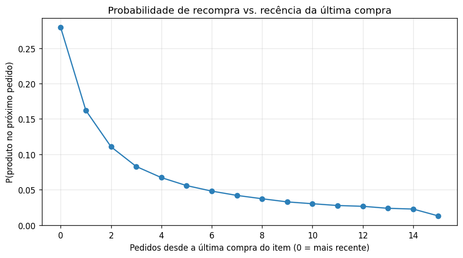

# Modelo, Métricas e Resultados
## Sistema de Recomendação de Produtos — Instacart

> **Documento didático.** Explica, de forma visual, **o modelo escolhido**, **as
> métricas** de avaliação (com o significado de cada uma e um exemplo passo a
> passo), **os resultados** e as **features mais importantes** (medidas
> empiricamente).
>
> **Mapa do documento:** [1) O modelo](#1-o-modelo-escolhido--mlp-com-features) ·
> [2) As métricas](#2-as-métricas-de-avaliação) ·
> [3) Os resultados](#3-os-resultados) ·
> [4) Features importantes](#4-as-features-mais-importantes-medido-empiricamente)

---

## 1. O modelo escolhido — MLP com features

### 1.1 A tarefa, em uma frase

> Para cada produto que o cliente **já comprou** antes (um *candidato*), o modelo
> estima a **probabilidade de ele voltar no próximo pedido**. Depois ordena os
> candidatos por essa probabilidade e recomenda os melhores.

**Analogia:** é como um caixa de supermercado experiente que conhece o cliente —
ele sabe que aquela pessoa "sempre leva leite e café, comprou fralda semana
passada, mas raramente repete aquele molho exótico" — e usa isso para adivinhar a
próxima cesta.

### 1.2 A arquitetura



O modelo combina **dois tipos de entrada**:

| Entrada | O que é | Por que ajuda |
|---|---|---|
| 🟧 **Embeddings** (produto, aisle, department) | transformam cada categoria num **vetor denso** aprendido | capturam **similaridade** — produtos parecidos ficam próximos no espaço |
| 🟩 **10 features numéricas** | descrevem o **comportamento** de compra (frequência, recência…) | dão o sinal que mais prevê recompra |

> 📦 **O que é um *embedding*?** Em vez de tratar cada produto como um código sem
> significado (produto 24852, produto 13176…), o embedding aprende para cada um um
> pequeno **vetor de números** (aqui, 32 valores) que o posiciona num "mapa de
> gostos". Produtos comprados pelas **mesmas pessoas** ficam próximos nesse mapa
> (dois iogurtes pertinho; iogurte e detergente bem longe). O modelo descobre
> esses vetores **sozinho**, durante o treino. É como dar a cada produto um "DNA
> numérico" que captura semelhança — muito mais rico que um simples código. Aqui
> usamos embeddings de **produto**, **aisle** (seção) e **department**.

Tudo é concatenado (54 números) e passa por uma **MLP** (rede neural densa:
camadas `128 → 64 → 1`, com ReLU e *dropout*), terminando num **sigmoid** que
devolve a probabilidade de recompra (0 a 1).

> 🔎 **Por que "MLP"?** *Multi-Layer Perceptron* — a rede neural mais simples, de
> camadas totalmente conectadas. Ela aprende **combinações não-lineares** dos
> sinais (ex.: "comprou com frequência **E** recentemente" pesa mais que a soma
> das partes).

### 1.3 Como treinamos

| Item | Valor | Em palavras |
|---|---|---|
| Perda | `BCEWithLogitsLoss` | erro de classificação binária (recomprou: sim/não) |
| Otimizador | Adam (lr = 1e-3) | o "motor" que ajusta os pesos |
| *Dropout* + *early stopping* | 0,2 / paciência 3 | evitam **decorar** os dados (overfitting) |
| Critério de parada | melhor **NDCG@10** na avaliação | paramos quando o ranking para de melhorar |
| Dados de treino / avaliação | ~6,78M / ~1,69M candidatos | **26.241 clientes nunca vistos** na avaliação |

> 🔑 **Decisão de design — sem embedding de ID de cliente.** Avaliamos em clientes
> *held-out* (não vistos no treino). Um "vetor de identidade" do cliente seria
> aleatório para eles (*cold-start*). Por isso o cliente é representado por
> **features agregadas** e mantemos só embeddings que **generalizam** (produto,
> aisle, department).

### 1.4 Por que este modelo, e não o "NCF puro"

> 🤖 **O que é o NCF?** *Neural Collaborative Filtering.* "Collaborative filtering"
> é a ideia de que **clientes parecidos gostam de coisas parecidas** — é assim que
> a Netflix recomenda filmes ou a Amazon sugere "quem comprou isto também levou
> aquilo". O NCF é uma rede neural que aprende esse padrão usando **apenas dois
> embeddings**: um para o **cliente** e um para o **produto**. Ele combina os dois
> vetores e prevê se haverá interação. É ótimo para descobrir **afinidades**, mas
> sozinho **não enxerga frequência nem recência** de compra.

Foi exatamente isso que observamos: o **NCF** — só com embeddings de **cliente e
produto**, sem as features — **não supera os baselines**. Conhecendo apenas
*identidades*, ele não sabe *com que frequência* nem *há quanto tempo* o cliente
compra cada item. A MLP com features enxerga isso e vence (Seção 3).

### 1.5 As features, com exemplos concretos

Para entender cada variável, vamos acompanhar a cliente **Maria**, que tem **10
pedidos** no histórico, e dois produtos que ela já comprou:

- 🥛 **Leite** — comprou em **9 dos 10** pedidos, inclusive no **último**.
- 🌶️ **Molho exótico** — comprou **1 vez**, há **5 pedidos**.

**Features do par cliente–produto** (descrevem *como Maria consome aquele item*):

| Feature | O que mede (e fórmula) | 🥛 Leite | 🌶️ Molho | Como se lê |
|---|---|---|---|---|
| `n_orders` | nº de vezes que comprou o item | **9** | 1 | Maria comprou leite 9 vezes |
| `up_order_share` | **frequência** = `n_orders / nº pedidos` | **0,90** | 0,10 | leite em 90% dos pedidos; molho em 10% |
| `up_purchase_rate` | **intensidade** = `n_orders / janela ativa` | **0,90** | 0,17 | leite quase todo pedido; molho raro mesmo desde que apareceu |
| `up_orders_since_last` | **recência**: pedidos desde a última compra | **0** | 5 | leite no último pedido; molho "esquecido" há 5 |
| `up_active_span` | janela de pedidos em que o item esteve ativo | 10 | 6 | leite presente desde o 1º pedido |
| `up_reorder_rate` | recompras / compras do par | **0,89** | 0,00 | leite é recomprado quase sempre; molho nunca repetiu |

**Features do cliente** (perfil geral da Maria, iguais para todos os produtos dela):

| Feature | O que mede | Valor (Maria) | Como se lê |
|---|---|---|---|
| `u_n_products` | variedade: nº de produtos distintos | 18 | Maria já comprou 18 produtos diferentes |
| `u_reorder_rate` | propensão geral do cliente a recomprar | 0,69 | 69% das compras de Maria são recompras |

**Features do produto** (estatística global, igual para todos os clientes):

| Feature | O que mede | 🥛 Leite | 🌶️ Molho | Como se lê |
|---|---|---|---|---|
| `p_n_users` | popularidade: nº de clientes que compraram | 80.000 | 1.200 | leite é muito mais popular |
| `p_reorder_rate` | propensão global do produto a ser recomprado | 0,78 | 0,35 | leite "vicia" mais que o molho |

> ✅ **Juntando tudo:** o leite tem **intensidade, frequência e recência altas** →
> o modelo devolve um `P(recompra)` **alto** e o coloca no topo da lista da Maria.
> O molho tem **recência baixa, comprado 1 vez e nunca repetido** → `P(recompra)`
> **baixo**. É assim que a rede transforma as features numa recomendação.

---

## 2. As métricas de avaliação

Todas medem a qualidade de um **ranking** (lista ordenada), olhando o **top-K**
(usamos K = 5, 10, 20; destaque em **K = 10**). A ideia: comparar os K produtos
recomendados com o **próximo pedido real** do cliente.

### 2.1 Um exemplo concreto

Vamos usar **um cliente** cujo próximo pedido real foi `{A, B, C, D, E}` (5 itens).
O modelo gerou esta lista de 10 recomendações (✓ = acerto, ✗ = erro):



Acertos: **4** (nas posições **1, 2, 4 e 7**). Vamos calcular cada métrica com
esses números.

### 2.2 Precision@K — *"não desperdicei recomendações"*

```
Precision@K = nº de acertos / K
Precision@10 = 4 / 10 = 0,40
```

Dos K recomendados, **quantos o cliente comprou**. No exemplo, 40% das sugestões
foram certeiras. É o "aproveitamento" da lista.

### 2.3 Recall@K — *"não deixei passar"*

```
Recall@K = nº de acertos / (tamanho do pedido real)
Recall@10 = 4 / 5 = 0,80
```

Do que o cliente comprou, **quanto a lista cobriu**. No exemplo, cobrimos 80% da
cesta (faltou só o item E).

> ⚖️ **Trade-off Precision × Recall.** Listas maiores (K maior) cobrem mais
> (**Recall sobe**) mas erram mais (**Precision cai**). Por isso olhamos as duas
> juntas — veja como elas se movem em direções opostas no nosso modelo:



### 2.4 NDCG@K — *"acertei no topo da lista?"*

As duas métricas acima **ignoram a ordem** (acertar na posição 1 ou na 10 dá o
mesmo). O **NDCG** corrige isso: ele **premia acertos no topo**, porque é lá que o
cliente olha.

```
DCG  = soma de  1 / log2(posição + 1)  para cada acerto
     = 1/log2(2) + 1/log2(3) + 1/log2(5) + 1/log2(8)      (posições 1,2,4,7)
     = 1,000 + 0,631 + 0,431 + 0,333 = 2,395
IDCG = DCG do ranking perfeito (5 acertos nas posições 1–5) = 2,949
NDCG@10 = DCG / IDCG = 2,395 / 2,949 ≈ 0,81
```

O termo `1/log2(posição+1)` é o **desconto**: quanto mais embaixo o acerto, menos
ele vale. NDCG vai de 0 (péssimo) a 1 (perfeito). **É a métrica principal** para
recomendação.

### 2.5 MAP@K — *"qualidade média das posições dos acertos"*

*Mean Average Precision.* Calcula a Precision **em cada posição de acerto** e tira
a média; depois faz a média entre todos os clientes.

```
Precisions nas posições de acerto: 1/1, 2/2, 3/4, 4/7 = 1,00; 1,00; 0,75; 0,571
AP@10 = (1,00 + 1,00 + 0,75 + 0,571) / 5 = 0,66
```

Premia juntar **vários** acertos e **cedo** na lista. Complementa o NDCG.

### 2.6 Resumo das 4 métricas

| Métrica | Pergunta | Sensível à ordem? | No exemplo |
|---|---|---|---|
| **Precision@K** | dos K, quantos acertei? | não | 0,40 |
| **Recall@K** | do pedido, quanto cobri? | não | 0,80 |
| **NDCG@K** | acertei no topo? | **sim** | 0,81 |
| **MAP@K** | acertos bons e cedo? | **sim** | 0,66 |

> **Por que 4?** Precision/Recall medem *acerto*; NDCG/MAP medem *qualidade da
> ordenação*. Juntas dão o retrato completo.

### 2.7 O protocolo (para a comparação ser justa)

- **Clientes *held-out*:** 26.241 clientes **nunca vistos no treino** → sem
  vazamento do alvo.
- **Re-ranking de candidatos:** cada modelo ordena os produtos que o cliente já
  comprou. Todos competem sob a **mesma régua**.

---

## 3. Os resultados

Comparamos **4 modelos**, do mais simples ao proposto, sob o mesmo protocolo:



Métricas **@10**, nos 26.241 clientes *held-out*:

| Modelo | Precision@10 | Recall@10 | **NDCG@10** | MAP@10 |
|---|---|---|---|---|
| 🩶 Popularidade (mais vendidos) | 0,169 | 0,214 | 0,237 | 0,133 |
| 🟦 Histórico (frequência) | 0,267 | 0,320 | 0,388 | 0,263 |
| 🟧 NCF (apenas IDs) | 0,176 | 0,222 | 0,243 | 0,139 |
| 🟩 **MLP com features** | **0,298** | **0,353** | **0,428** | **0,300** |

**Como ler:**

- 🟩 **A MLP com features vence em tudo.** Sobre o forte baseline de **histórico**:
  **+10%** de NDCG@10 (0,428 vs 0,388). Sobre **popularidade**: **+80%**.
- **Na prática:** de cada 10 recomendações, **~3 são compradas** (Precision 0,30) e
  a lista **cobre ~35%** da próxima cesta (Recall 0,35).
- 🟧 **O NCF de IDs puros colapsa** para perto da popularidade (0,243) — só com
  identidades, ele não captura frequência/recência.
- ✋ *Early stopping*: a MLP atingiu o pico na **época 2** e parou na 5 — sem
  overfitting.

---

## 4. As features mais importantes (medido empiricamente)

Para saber **o que o modelo realmente usa**, aplicamos **permutation importance**:
embaralhamos uma feature por vez na avaliação (destruindo o sinal dela) e medimos
**quanto o NDCG@10 cai**. Quanto maior a queda, mais o modelo depende dela.



### 4.1 O que o gráfico revela

- 🟩 **O comportamento cliente-produto domina.** As 4 primeiras features somam
  **~56%** da importância. Elas descrevem *como aquele cliente consome aquele
  produto*.
- 🥇 **Intensidade de consumo** (compras por pedido) é a feature nº 1, sozinha com
  **29,5%**. 🥈 **Recência** (há quanto tempo comprou) vem em 2º (**13,5%**).
  Juntas, ~43% — fazem sentido: o que se compra **muito** e **há pouco tempo** é o
  mais provável de voltar.
- 🟧 **Os embeddings de categoria quase não pesam** (aisle/department < 0,3%). A
  identidade do produto agrega um pouco (2,7%), mas **o grosso do poder vem do
  comportamento, não da categoria**.

### 4.2 A feature campeã na prática: recência

A relação entre **recência** e recompra é direta e forte — a probabilidade de
recomprar **despenca** conforme o item fica "esquecido":



> 🧠 **Nota metodológica.** Algumas features são correlacionadas (`up_purchase_rate`,
> `up_order_share` e `n_orders` derivam todas da frequência de compra). A
> *permutation importance* pode distribuir o crédito entre elas; ainda assim o
> quadro é claro: **intensidade + recência de compra são o coração do modelo**.

---

## 5. Conclusão

- O modelo escolhido — **MLP com embeddings + features** — supera com folga os
  baselines e o NCF puro, em **todas as 4 métricas**.
- O ganho **não vem de "mais IA"**, e sim de **dar o contexto certo** à rede: as
  features de **intensidade, recência e frequência** de compra.
- Próximos passos: rastrear no **MLflow**, escrever o **Model Card** e refatorar o
  código validado para `src/`.

---

<sub>Resultados de [`notebooks/06_models_comparison.ipynb`](../notebooks/06_models_comparison.ipynb).
Importância via *permutation importance* sobre `models/feature_mlp.pt`. Figuras em `docs/img/`.</sub>
