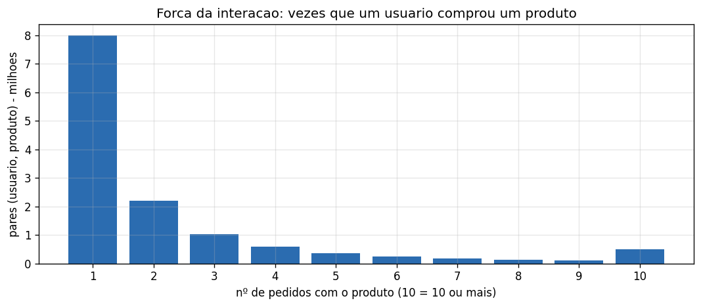
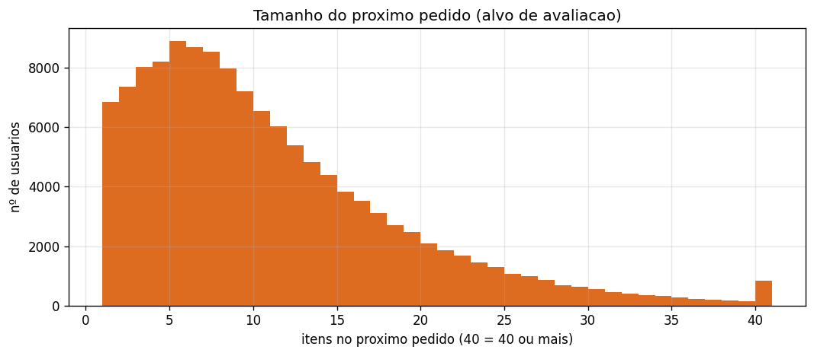

# Relatório de Pré-processamento
## Sistema de Recomendação de Produtos — Instacart

> **Para quem é este documento:** o time técnico (cientista de dados / ML
> engineer) que precisa entender **como** os dados foram preparados, e também o
> time de negócio que quer saber **o que** essa etapa habilita — sem ler código.
>
> Etapa correspondente ao estágio `preprocess` do pipeline. Gerado a partir de
> [`notebooks/02_preprocessing.ipynb`](../notebooks/02_preprocessing.ipynb).

---

## 🎯 Resumo executivo

- Transformamos **32 milhões de itens comprados** em **13,3 milhões de interações
  únicas** (quem comprou o quê, e com que intensidade).
- Cada usuário e cada produto recebeu um **código interno** que o motor de
  recomendação consegue aprender (pré-requisito para a rede neural).
- Separamos o **próximo pedido real** de cada cliente como **gabarito de
  avaliação** — para medir a qualidade com honestidade, sem "espiar" o futuro.
- A base está **limpa e praticamente sem pontas soltas**: apenas **9 itens**
  (de 1,38 milhão) ficaram sem histórico (*cold-start*).

| Indicador | Valor |
|---|---|
| Interações únicas (usuário, produto) | **13.307.953** |
| Usuários | 206.209 |
| Produtos | 49.677 |
| Linhas de validação (próximos pedidos) | 1.384.617 |
| Usuários na validação | 131.209 |
| Itens cold-start | 9 (≈ 0,0006%) |

---

## 1. De histórico bruto a "interações"

Os dados brutos vêm espalhados em tabelas (pedidos de um lado, itens de outro).
O primeiro passo foi **juntá-los e resumir** o histórico em **interações únicas**:
para cada par (usuário, produto), quantas vezes o usuário comprou (`n_orders`) e
quantas foram recompra (`n_reorders`).

> 👔 **Visão de negócio:** a grande maioria dos produtos é **experimentada uma
> única vez** — 60% dos pares (usuário, produto) aparecem só 1 vez. Um **núcleo
> menor** é comprado de forma recorrente (a cauda à direita). Isso reforça a
> estratégia: o recomendador deve **acertar o núcleo de hábito** de cada cliente
> e, em paralelo, **estimular descoberta** no restante.

> 🔬 **Visão técnica:** o sinal implícito por par é "ralo" (média de **2,44**
> compras por par; **40%** dos pares foram recomprados ao menos uma vez). Guardar
> a **força** (`n_orders`, `n_reorders`) — em vez de só "comprou/não comprou" —
> dá ao modelo um alvo mais informativo e vira **feature** natural.

---

## 2. Um "código" para cada usuário e produto

Identificadores originais são esparsos (vão a dezenas de milhares, com buracos).
Nós os traduzimos para **códigos sequenciais** (0, 1, 2, …) e guardamos esse
dicionário de tradução.

> 👔 **Visão de negócio:** é como dar um "número de crachá" contínuo a cada
> cliente e produto, para o sistema conseguir referenciá-los de forma eficiente.

> 🔬 **Visão técnica:** camadas de **embedding** (base do *Neural Collaborative
> Filtering*) exigem índices **contíguos** `0…N-1` — cada índice é uma linha na
> tabela de vetores aprendidos. Criamos *encoders* determinísticos (ordenados,
> com seed fixa) para **206.209 usuários** e **49.677 produtos**, e salvamos os
> mapas `id ↔ índice` para reaplicar na validação e **decodificar** as
> recomendações depois.

---

## 3. Separando o "próximo pedido" para avaliar com honestidade

Para cada cliente, guardamos os produtos do seu **próximo pedido real** (o pedido
`train`) como **gabarito**. É contra ele que vamos comparar as recomendações.

> 👔 **Visão de negócio:** o que o sistema precisa acertar é uma **cesta de cerca
> de 10 itens** (mediana de 9, média de 10,5). Esse é o "tamanho do desafio": de
> ~50 mil produtos, prever quais ~10 o cliente vai levar a seguir.

> 🔬 **Visão técnica:** usamos a **divisão temporal nativa** do dataset (`prior` =
> histórico para treino; `train` = próximo pedido para validação), o que evita
> **vazamento de dados**. São **1.384.617** linhas de gabarito para **131.209**
> usuários. Apenas **9 itens** não tinham histórico (*cold-start*) — irrelevante,
> então o problema de partida fria praticamente não nos afeta aqui.

---

## 4. Artefatos gerados

Tudo foi salvo em `data/processed/` no formato **parquet** (compacto e tipado),
pronto para os próximos notebooks e para virar estágios do pipeline DVC:

| Artefato | Conteúdo |
|---|---|
| `interactions.parquet` | interações únicas (user, product) + força + índices |
| `user_id_map.parquet` | tradução `user_id ↔ user_idx` |
| `product_id_map.parquet` | tradução `product_id ↔ product_idx` |
| `val_ground_truth.parquet` | cestas reais do próximo pedido (avaliação) |

> 🔬 **Nota técnica:** esses arquivos **não vão para o git** — serão versionados
> pelo **DVC** na Etapa 3, garantindo reprodutibilidade dos dados.

---

## 5. Implicações para a modelagem

- **Embeddings de usuário e produto** (índices contíguos já prontos) → arquitetura
  estilo *Neural Collaborative Filtering*.
- **Força da interação** (`n_orders`, `n_reorders`) como sinal/feature.
- **Cold-start desprezível** → não precisamos de tratamento especial agora.
- **Avaliação temporal honesta** já montada (próximo pedido como gabarito).

**Próximo passo (`notebook 03`):** engenharia de features e definição do *framing*
de treino — NCF com amostragem de negativos vs. predição de recompra.

---

Números e gráficos derivados de [`notebooks/02_preprocessing.ipynb`](../notebooks/02_preprocessing.ipynb)
e dos artefatos em `data/processed/`.
