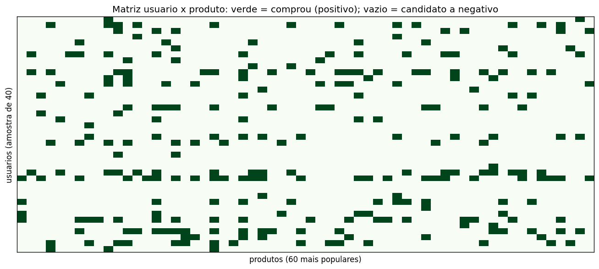
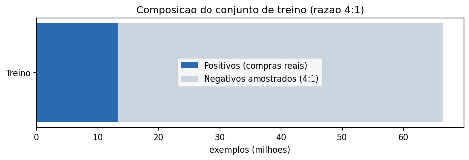

# Relatório do Dataset de Treino (NCF)
## Sistema de Recomendação de Produtos — Instacart

> **Para quem é este documento:** o time técnico (cientista de dados / ML
> engineer) que precisa entender **como** montamos os exemplos de treino do
> modelo neural, e também o time de negócio que quer a intuição de **por que**
> fazemos isso — sem ler código.
>
> Etapa correspondente à preparação do dataset do modelo. Gerado a partir de
> [`notebooks/03_train_dataset.ipynb`](../notebooks/03_train_dataset.ipynb).

---

## 🎯 Resumo executivo

- O modelo escolhido é um **Neural Collaborative Filtering (NCF)** — uma rede
  neural que aprende "gostos" de clientes e produtos via *embeddings*.
- Para aprender, a rede precisa de **dois tipos de exemplo**: o que o cliente
  comprou (**positivos**) e o que ele *não* comprou (**negativos**).
- Só temos os positivos (**13,3 milhões**). Os negativos são **gerados por
  amostragem** — sorteando produtos que o cliente não levou.
- A geração é **reprodutível, eficiente e limpa**: a taxa de "falsos negativos"
  (colisões) é de apenas **0,22%**, e nós a removemos.

| Indicador | Valor |
|---|---|
| Exemplos positivos (compras reais) | **13.307.953** |
| Razão de negativos adotada | 4 : 1 |
| Conjunto de treino projetado (4:1) | ~66,5 milhões de exemplos |
| Taxa de colisão na amostragem | 0,22% (removida) |

---

## 1. Por que precisamos de "exemplos negativos"?

> 👔 **Visão de negócio:** é como ensinar alguém a reconhecer um "gato"
> mostrando **só** fotos de gatos — sem ver "não-gatos", a pessoa não aprende a
> diferença. O histórico só tem **compras** (os "gatos"). Para a IA aprender o
> que **diferencia** o que o cliente quer do que ele ignora, ela também precisa
> ver exemplos de **não-compra**.

> 🔬 **Visão técnica:** temos *feedback implícito* de uma só classe (apenas
> positivos). O NCF é treinado como classificação binária `P(interação | user,
> item)`, o que exige exemplos negativos. Como não existem negativos rotulados,
> usamos **negative sampling**.

---

## 2. Os positivos: o que cada cliente já comprou

Cada par (cliente, produto) observado no histórico é um exemplo **positivo**. Na
matriz abaixo (amostra de 40 clientes × 60 produtos populares), cada célula
**verde** é uma compra real:

> 👔 **Visão de negócio:** as células verdes são o que **sabemos** — as compras.
> Repare como a maior parte da grade está **vazia**: ninguém compra tudo. Esse
> "vazio" é justamente de onde tiramos os exemplos negativos.

> 🔬 **Visão técnica:** a matriz é altamente esparsa (visto no EDA: 99,87%
> vazia). Cada célula preenchida vira um positivo (rótulo 1); as vazias são o
> universo de onde amostramos negativos.

---

## 3. Amostragem de negativos

Para cada compra real, sorteamos produtos aleatórios que o cliente **não**
comprou e os rotulamos como negativos (rótulo 0).

> 👔 **Visão de negócio:** mostramos ao modelo, para cada "comprou", alguns
> exemplos de "não comprou" — para ele aprender a separar interesse de
> indiferença.

> 🔬 **Visão técnica:** amostragem **uniforme**, vetorizada e com *seed* fixa
> (reprodutível). Um negativo que por acaso seja um positivo do mesmo usuário
> (colisão) é removido — na demonstração (100 mil positivos × 2), só **0,22%**
> foram colisões. A amostragem roda **dinamicamente a cada época** no treino,
> expondo o modelo a negativos novos e melhorando a generalização (por isso não
> materializamos os negativos em disco).

---

## 4. Composição do conjunto de treino

Adotamos a razão **4 negativos para cada positivo** (padrão em NCF):

> 🔬 **Nota técnica:** isso resulta em ~66,5 milhões de exemplos. Como o PyTorch
> está em build **CPU**, no notebook de treino (05) provavelmente usaremos um
> **subconjunto de usuários** para o treino ser viável em tempo — uma escolha de
> engenharia, sem prejuízo conceitual (segue sendo um recomendador legítimo, com
> milhões de interações).

---

## 5. Implicações para a modelagem

- **Insumo pronto:** `train_positives.parquet` + função `sample_negatives` (a ser
  chamada por época no treino).
- **Arquitetura:** embeddings de usuário e produto → MLP → probabilidade de
  interação (NCF).
- **Avaliação:** o modelo gera um *score* por produto e ranqueia; comparamos o
  top-N com o próximo pedido real (do notebook 02).

**Próximo passo (`notebook 04`):** baseline de **popularidade** e as **métricas
de ranking** (Precision@K, Recall@K, NDCG@K, MAP@K) — a régua que vai provar se a
rede neural supera abordagens simples.

---

Números e gráficos derivados de [`notebooks/03_train_dataset.ipynb`](../notebooks/03_train_dataset.ipynb)
e dos artefatos em `data/processed/`.
